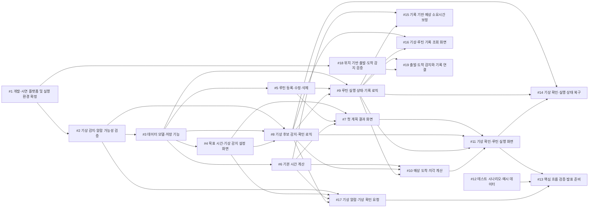

# 5주차 활동지 / Week 5 Worksheet

**1-page 기획서 / One-page plan**

- 작성일 / Date: 2026년 9월 30일
- 참여자 / Present: 강동혁, 박제헌, 오형석

---

## ① 주제 확정 / Confirm topic

- 확정 주제 / Topic: 수면 관리 및 아침 루틴 앱
- 이유 / Reason: 기상과 출발 준비는 반복적으로 발생하는 일상 상황이며, 목표 도착 시각, 준비 시간, 이동 시간, 수면 시간처럼 측정 가능한 요소를 통해 문제 발생 여부와 개선 효과를 확인할 수 있다. 계획한 시각보다 늦게 기상한 경우에도 활동 징후와 루틴 진행 상태를 바탕으로 예상 도착 시각을 다시 계산하여, 사용자가 필요한 준비와 출발 시각을 판단하도록 돕는다. 또한 시간 계산, 기상 감지와 알람 기능을 중심으로 핵심 기능의 범위를 제한할 수 있어 수업 기간 내에 프로토타입을 구현하고 사용자 테스트를 진행하기 적합하다고 판단하여 이 주제를 선택했다.

---

## ② 태스크 분해와 의존 관계 / Tasks and dependencies

### 태스크 목록 / Task list

4주차 사용자 스토리와 완료 조건을 태스크로 나눕니다.
*Break down your Week 4 user stories and acceptance criteria into tasks.*

각 태스크는 따로 끝내도 맞는지 확인할 수 있어야 합니다. 담당에 '다 같이'는 쓰지 않습니다.
*Each task must be checkable on its own. Do not write "everyone" as owner.*

| # | 태스크 Task | 완료 조건 Done when | 선행 태스크 Depends on | 담당 Owner |
|---|---|---|---|---|
| 1 | 개발·시연 플랫폼 및 기본 실행 환경 확정 | 우선 지원할 플랫폼과 테스트 기기를 정하고 해당 기기에서 기본 앱 화면을 실행한다. 다른 플랫폼 지원 여부를 기록한다. | 없음 | 강동혁 |
| 2 | 기상 감지 및 알람 가능성 검증 | 선택한 플랫폼에서 화면 켜짐 이벤트 감지와 예약한 시각의 소리·진동 알람을 시험한다. 앱 실행 중·백그라운드·종료 상태별 결과와 필요한 권한·제약을 기록하고, 핵심 사용 상황에 적용 가능한지 판단한다. 적용이 어려우면 대체 감지·알람 방식 또는 범위 변경안을 팀에서 결정한다. | 1 | 강동혁 |
| 3 | 설정·기상·루틴·실행 기록 데이터 모델과 저장 기능 구현 | 목표 도착 시각, 이동 시간, 설정 수면 시간, 수동 설정 기상 시각, 기상 시각 적용 방식(권장/수동), 기상 감지 시간 구간, 기상 후보·확정 기록, 루틴 단계, 실행 기록의 구조를 정의한다. 예시 데이터를 저장하고 앱 재실행 후 조회한다. | 2 | 강동혁 |
| 4 | 목표 시간 및 기상 감지 설정 화면 구현 | 목표 도착 시각, 이동 시간, 설정 수면 시간, 수동 설정 기상 시각과 기상 감지 시간 구간을 입력·수정·저장하고 다시 불러온다. 권장 기상 시각 사용 또는 수동 설정 사용을 선택할 수 있으며, 빈 입력과 잘못된 값을 안내한다. | 3 | 박제헌 |
| 5 | 루틴 등록·수정·삭제 화면 구현 | 루틴명과 단계별 이름·순서·예상 소요시간을 저장한다. 수정·삭제 결과가 다시 조회했을 때 반영된다. | 3 | 박제헌 |
| 6 | 기본 시간 계산 로직 구현 | 사용자 입력값으로 준비 시간과 권장 출발·기상 시각을 계산한다. 기상 시각 적용 방식에 따라 알람 시각을 결정하고, 적용한 기상 시각에서 설정 수면 시간을 빼 취침 시각을 계산한다. 날짜를 포함해 자정을 넘는 경우를 처리하고, 미리 정한 예시의 기대값과 일치한다. | 3 | 강동혁 |
| 7 | 첫 계획 결과 화면 연결 | 설정과 루틴을 입력하면 저장된 값을 읽어 권장 출발·기상 시각, 실제 적용할 알람 시각과 이에 따른 취침 시각을 구분하여 표시한다. 필수 입력이 없으면 입력 화면으로 안내한다. | 4, 5, 6 | 박제헌 |
| 8 | 기상 후보 감지 및 확인 로직 구현 | #2에서 채택한 방식으로 설정된 시간 구간의 활동 징후를 감지하여 기상 후보로 기록한다. 후보 취소 후 재감지 조건과 반복 이벤트를 묶는 시간 기준을 정하고, 사용자 확인·취소 및 중복 이벤트 처리 규칙을 구현·검증한다. 수동 기상 입력으로 누락·오탐을 보완하고, 확인 전 후보는 실제 기상 기록으로 확정하지 않는다. | 2, 3, 4 | 강동혁 |
| 9 | 루틴 실행 상태 및 기록 로직 구현 | 확인된 기상 상태에서 루틴을 시작하거나 사용자가 직접 루틴을 시작할 수 있다. 단계 완료·건너뛰기·전체 종료를 처리하고 수행 결과를 저장한다. 수동 루틴 시작만으로 기상 시각을 확정하지 않으며, 기상 확인은 별도로 처리한다. 또한 중복 입력으로 기록이 중복되지 않는다. | 3, 5, 8 | 강동혁 |
| 10 | 기상 후보 및 실행 상태에 따른 예상 도착·지각 계산 구현 | 기상 후보 감지 시 현재 시각을 기준으로 준비를 시작했을 때의 예상 도착·지각 시간을 계산한다. 루틴 실행 후에는 진행 상태에 따라 갱신한다. 기상 확인 전에는 조건부 예상임을 구분하고, 단계별 예상시간 초과 시 남은 시간 계산 규칙을 정하고 검증한다. 예상시간을 넘겼다는 이유로 단계를 자동 완료하지 않는다. | 6, 8, 9 | 강동혁 |
| 11 | 기상 확인 및 루틴 실행 화면 연결 | 기상 후보 시각과 확인·취소 조작을 표시한다. 수동 기상 입력, 루틴 시작·단계 완료·건너뛰기·종료가 가능하다. 현재 단계, 경과 시간, 예상 도착·지각 시간을 표시하고, 확인 전에는 “지금 준비를 시작하면”이라는 조건을 표시한다. | 7, 8, 9, 10 | 박제헌 |
| 12 | 테스트 시나리오·예시 데이터 작성 | 알람 발생·해제·다시 울림, 수동 기상 시각 설정, 정상 기상, 늦은 기상, 잠깐 화면을 켠 뒤 후보 취소, 반복 화면 켜짐, 감지 누락과 수동 입력, 지각 예상, 잘못된 입력, 자정 경계 사례의 조작 순서와 기대 결과를 작성한다. #2의 검증 결과에 따라 앱 상태별 사례를 보완한다. | 없음 | 오형석, 리뷰: 강동혁 |
| 13 | 핵심 흐름 검증 및 발표 시연 준비 | 설정 → 기상 알람 발생 → 기상 후보 감지 → 확인 또는 취소 → 루틴 실행 → 예상 도착·지각 확인 → 완료 및 기록 저장 흐름을 검증한다. 알람 해제·다시 울림과 #12의 실패 사례 및 수동 보완 경로도 확인한다. 실제 감지 시연과 테스트 이벤트를 이용한 시연을 구분하고, 결함 수정 후 재검증한다. | 11, 12, 17 | 오형석, 결함 수정: 각 구현 담당 |
| 14 | 기상 확인 및 루틴 실행 상태 복구 구현 | 앱 재실행 후 미확인 기상 후보와 진행 중인 루틴을 복원한다. 확인·취소한 후보는 다시 미확인 상태로 나타나지 않는다. 앱을 닫아 둔 시간을 경과 시간에 반영하고, 종료한 루틴은 실행 상태로 복원하지 않는다. | 8, 9, 11 | 강동혁 |
| 15 | 실제 기록 기반 예상 소요시간 보정 | 완료한 단계의 실제 소요시간으로 이후 예상시간을 보정한다. 사용할 기록 수, 건너뛴 기록의 제외 여부, 기록 부족 시 기본값 사용 규칙을 정하고 검증한다. | 6, 9 | 강동혁 |
| 16 | 기상 및 루틴 기록 조회 화면 구현 | 날짜별 예정·확정 기상 시각, 루틴 수행 여부, 실제 소요시간을 표시한다. 미확인·취소된 후보를 확정 기상 기록과 구분하고, 빈 기록 및 조회 실패 상태를 처리한다. | 8, 9 | 박제헌 |
| 17 | 기상 알람 및 기상 확인 요청 구현 | #2에서 검증한 방식으로 권장 기상 시각 또는 수동 설정 기상 시각에 소리·진동 알람을 제공한다. 다시 울림 간격과 기상 확인 시 예약 취소 규칙을 정하고, 알람 해제·다시 울림을 처리한다. 알람 해제와 기상 확정을 구분한다. 기상 후보 감지 시 확인을 요청하며, 권한 거부 및 설정 변경을 처리하고 중복 알람·요청을 방지한다. 선택한 플랫폼에서 백그라운드·앱 종료 상태별 동작 조건을 검증하고 지원 범위를 명시한다. | 2, 4, 6, 8 | 강동혁, 검증: 오형석 |
| 18 | 위치 기반 출발·도착 감지 가능성 검증 | 선택한 플랫폼에서 위치 권한, 지정 반경 진입·이탈, 백그라운드 감지를 시험한다. 동작 조건과 한계를 기록하고 적용 여부를 결정한다. | 1 | 강동혁 |
| 19 | 출발·도착 감지와 실행 기록 연결 | #18에서 채택한 조건으로 출발·도착 이벤트를 기록한다. 중복 이벤트를 처리하고, 위치 권한이 없으면 수동 출발·도착 입력으로 기록할 수 있다. | 9, 18 | 강동혁 |

### 의존 관계 그래프 / Dependency graph (DAG)

화살표는 "앞 태스크가 끝나야 뒤 태스크를 할 수 있다"는 뜻입니다.
*An arrow means the first task must finish before the second can start.*

- 지금 착수 가능 (진입 차수 0) / Can start now (in-degree 0): #1 개발·시연 플랫폼 및 기본 실행 환경 확정, #12 테스트 시나리오·예시 데이터 작성
- 작업 순서 (위상정렬) / Work order (topological sort): #1 → #12 → #2 → #3 → #4 → #5 → #6 → #7 → #8 → #9 → #10 → #11 → #17 → #13 → #14 → #15 → #16 → #18 → #19
- 사이클이 있었다면 어떻게 풀었는가 / If there was a cycle, how did you fix it?: 현재 의존 관계에는 사이클이 없다. 기본 시간 계산(#6)과 기록 기반 시간 보정(#15)을 분리하여, 실제 수행 기록이 쌓이기 전에도 계획 및 실행 흐름을 구현할 수 있도록 구성했다.

---

## ③ 범위 결정 / Scope

### Must — 없으면 성립 안 됨 / essential

- 핵심 시나리오 / Core scenario: 아침 등교 준비 시간을 관리하려는 대학생이 목표 도착 시각, 이동 시간, 원하는 수면 시간과 준비 루틴을 등록한다. 앱은 권장 출발·기상·취침 시각을 계산하고 설정된 기상 시각에 알람을 제공한다. 화면 켜짐 등 검증된 활동 신호를 감지하면 기상 후보로 기록하고 사용자에게 확인을 요청한다. 사용자가 기상을 확인하고 루틴을 진행하면 예상 도착 시각과 지각 시간을 갱신하며, 종료 후 수행 기록을 저장한다.

- 필수 기능:
  - 목표 도착 시각, 이동 시간, 원하는 수면 시간, 권장/수동 기상 시각 적용 방식 및 기상 감지 시간 구간 설정
  - 준비 루틴과 단계별 순서·예상 소요시간의 등록·수정·삭제
  - 권장 출발·기상·취침 시각 계산 및 표시
  - 계산된 권장 기상 시각 또는 사용자가 변경한 기상 시각에 소리·진동 알람 제공
  - 알람 해제·다시 울림 처리 및 알람 해제와 기상 확정의 구분
  - 화면 켜짐 등 검증된 활동 신호를 통한 기상 후보 감지
  - 기상 후보 확인·취소 및 감지 누락·오탐을 보완하는 수동 기상 입력
  - 루틴 시작, 단계 완료·건너뛰기, 전체 종료
  - 기상 확인 전 조건부 예상 도착·지각 시간 표시 및 실행 중 갱신
  - 기상 확인 결과와 루틴 수행 기록 저장
  - 잘못된 입력, 자정 경계, 중복 이벤트 및 권한 거부 처리

- 구현 범위:
  - 우선 지원할 플랫폼 하나에서 핵심 흐름을 완성한다.
  - 이동 시간과 수면 시간은 사용자가 직접 입력하고, 준비 시간은 단계별 예상 소요시간을 합산한다.
  - 기상 후보 감지는 실제 기상 확정과 구분한다. 확인되지 않은 후보를 실제 기상 기록으로 저장하지 않는다.
  - 자동 감지와 알람의 앱 실행 중·백그라운드·종료 상태별 동작 조건을 초기에 검증하고 지원 범위를 명시한다.
  - 핵심 사용 상황에서 자동 감지가 불가능하면 대체 감지 방식 또는 서비스 범위를 팀에서 다시 결정한다. 수동 입력만으로 자동 감지 기능이 완료됐다고 판단하지 않는다.

- 관련 태스크: #1~#13, #17

### Should — 핵심 흐름 완성 후 우선 추가

- 시나리오:
  - 앱을 종료했다가 다시 실행하면 미확인 기상 후보와 진행 중인 루틴을 복원한다.
  - 실제 수행 기록이 쌓이면 단계별 예상 소요시간을 보정한다. 기록이 부족하면 사용자 입력값을 사용한다.
  - 날짜별 예정·확정 기상 시각, 루틴 수행 여부 및 실제 소요시간을 조회한다.

- 관련 태스크: #14~#16

### Could — 구현 가능성과 여유를 확인한 뒤 추가

- 시나리오: 지정된 장소의 출발·도착을 위치 기반으로 감지하여 실행 기록에 반영한다. 위치 권한이 없거나 자동 감지가 실패하면 수동으로 기록한다.
- 적용 조건: 핵심 흐름 완성 후 위치 감지의 정확도와 백그라운드 동작 조건을 확인하여 채택한다. 핵심 기능의 구현과 검증을 지연시키면 제외한다.
- 관련 태스크: #18~#19

### Won't — 이번 학기에 안 함 / not this semester

| Won't 항목 Item | 포기한 이유 Why |
|---|---|
| 실제 수면 상태 자동 측정 및 수면의 질 평가 | 설정한 수면 시간을 기준으로 취침·기상 계획을 제공하는 데 집중한다. 화면 켜짐과 알람 해제만으로 실제 수면 상태를 판단하지 않는다. |
| 실시간 교통 정보 및 경로 탐색 | 외부 서비스 연동 범위를 줄이고 기상 감지·알람·루틴 실행을 우선 완성한다. 이동 시간은 직접 입력한다. |
| Android와 iOS 동시 지원을 필수 완료 조건으로 설정 | 플랫폼별 감지·알람 동작을 검증하는 부담을 고려해 우선 플랫폼 하나를 지원한다. |
| 회원가입 및 여러 기기 간 동기화 | 초기 버전은 한 기기에서 개인이 사용하는 형태로 제한한다. |
| 사용자 간 기록 공유 및 순위 기능 | 개인의 기상과 아침 준비를 지원하는 핵심 시나리오에 필요하지 않다. |

### 실행 가능성 확인 / Feasibility check

- 특수 장비·유료 API·실제 개인정보가 필요한가? 필요하다면 대안은?
  *Does it need special hardware, paid APIs or real personal data? If so, what is the alternative?*
  - 핵심 기능은 선택한 플랫폼의 테스트 스마트폰과 직접 입력한 시간·루틴 데이터로 구현한다. 특수 장비와 유료 API는 필수로 사용하지 않는다.
  - 기상 감지와 알람에 필요한 권한 및 동작 제약은 초기 검증으로 확인한다.
  - 위치 기능을 채택하면 실제 주거지 대신 테스트 장소를 사용하고, 연속 이동 경로는 저장하지 않는 방향으로 설계한다.
  - 지원하지 않는 플랫폼의 사용자는 해당 버전을 이용할 수 없으므로 지원 범위를 명시하고 ETHICS.md에 영향을 기록한다.
- 15주차에 발표장에서 시연할 수 있는 형태인가?
  *Can it be demonstrated live in Week 15?*
  - 가까운 시각으로 기상 알람을 설정하고, 짧은 준비 루틴으로 알람 발생 → 활동 신호 감지 → 기상 확인 → 루틴 실행 → 예상 도착·지각 확인 → 기록 저장을 시연한다.
  - 실제 기기의 화면 켜짐 감지와 테스트 이벤트를 이용한 시연을 구분한다. 테스트 이벤트만으로 실제 자동 감지가 검증됐다고 설명하지 않는다.
  - 정상 기상, 늦은 기상, 기상 후보 취소, 감지 누락 후 수동 입력 사례를 준비한다.
  - 위치 기반 출발·도착 감지는 핵심 시연의 필수 조건으로 두지 않는다.

---

## ④ 가장 먼저 동작시킬 흐름 (Walking Skeleton) / First end-to-end flow

> 목표 도착 시각, 이동 시간, 준비 소요시간을 입력하면 → 값을 저장하고 기상 시각을 역산한다. 테스트용으로 가까운 시각에 알람을 설정한 뒤, 알람 발생 후 화면 켜짐을 감지하여 기상 후보를 기록한다 → 화면에 기상 확인 버튼과 “지금 준비를 시작하면”의 예상 도착 시각·지각 시간이 표시된다.

- 처음에는 준비 루틴을 한 단계로 고정하고, 사용자가 입력한 소요시간으로 계산한다.
- 실제 기기의 화면 켜짐 이벤트를 연결하여 자동 감지가 동작하는지 확인한다. 테스트 이벤트는 개발 보조용으로 구분한다.
- 기상 확인 버튼을 누르면 후보를 확정하고 기록이 저장되는 것까지 확인한다.
- 첫 흐름 완성 후 여러 단계의 루틴 실행과 다시 울림을 추가하여 Must 범위를 완성하고, 이후 기록 기반 시간 보정과 기록 조회 기능을 확장한다.

---

> 수업 종료 시 커밋하세요 / Commit this at the end of class
> `git add docs/week-05.md && git commit -m "docs: 5주차 활동지 작성"`
